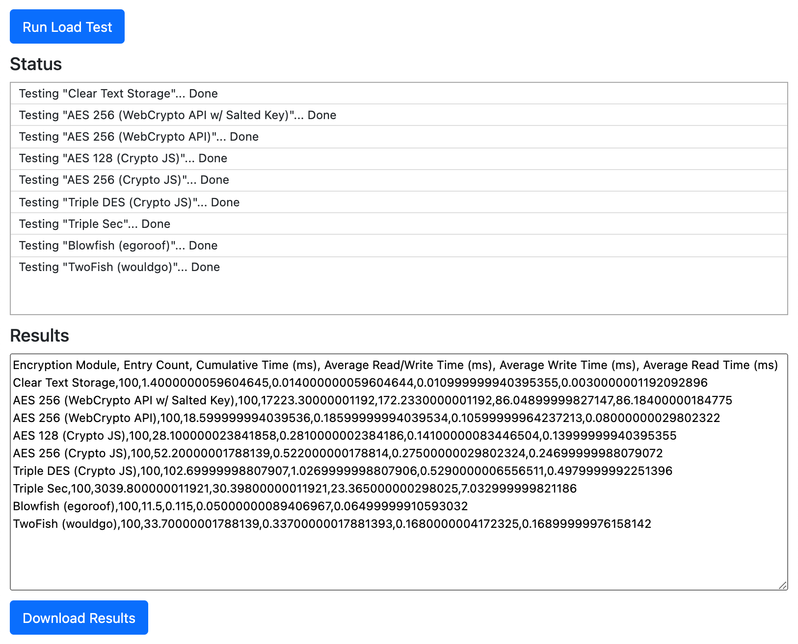

# MacFadden CSC-803 Research Project
This repository hosts Michael MacFadden's Final Project source code for CSC-803 "An Introduction to Cyber Security Research".

* [Introduction](#introduction)
* [Dependencies](#dependencies)
* [Build](#build)
* [Command Line Testing for NodeJS](#command-line-test-for-nodejs)
* [Browser Testing](#browser-testing)
* [Encryption Algorithms](#encryption-algorithms)

# Introduction

# Dependencies
  * NodeJS 14.x
  * Yarn 1.22.x

# Build

```shell
yarn install
npm run build
```

# Command Line Test for NodeJS
```
npm run load-test
```

# Browser Testing
You must have already built the code before using the browser tests. Assuming the code is built, then simply open the [test-pages/index.html](test-pages/index.html) file in a browser.  Then click the "Run Load Test" button at the top of the screen. Once the tests have completed you can download a comma separated value (CSV) file containing the results by hitting the "Download Results" button at the bottom of the screen.



## Encryption Algorithms

* CryptoJS
  * AES-128
  * AES-256
  * DES
  * TripleDES

* WebCrypto API
    * AES 128
    * AES 256
    
* egoroof-blowfish
  * Blowfish

* twofish
  * Two Fish

* TripleSec
    * TripleSec
