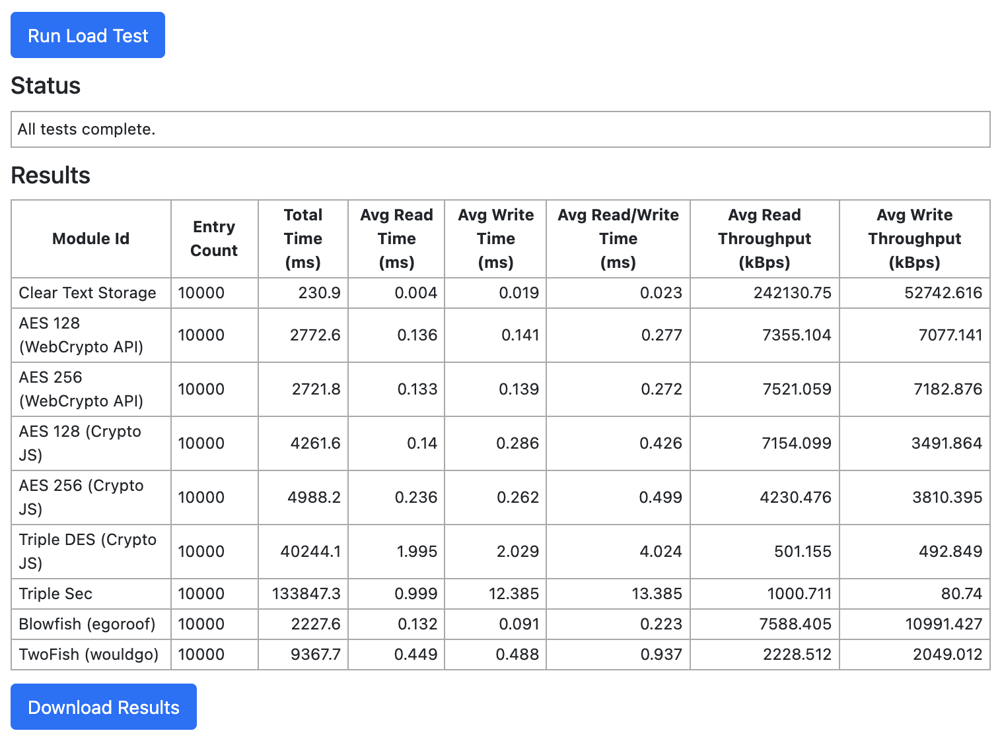

# MacFadden CSC-803 Research Project
This repository hosts Michael MacFadden's Final Project source code for CSC-803 "An Introduction to Cyber Security Research". This README gives a brief overview of the project and the code implementation.

* [Introduction](#introduction)
* [Design](#design)
* [Implementation](#implementation)
* [Dependencies](#dependencies)
* [Build](#build)
* [Unit Testing](#unit-testing)
* [Command Line Testing for NodeJS](#command-line-test-for-nodejs)
* [Browser Testing](#browser-testing)
* [Encryption Algorithms](#encryption-algorithms)

# Introduction
The [Web Storage API](https://developer.mozilla.org/en-US/docs/Web/API/Web_Storage_API) is allows browsers to store persistent key value pair data on a clients machine. This storage is commonly used for caching, user tracking, and allowing applications to work offline. Most modern web applications make use of Web Storage in some fashion. However, most local storage is stored in an unencrypted fashion. Websites may store personal and otherwise sensitive data in local storage. This can be problematic for shared machines or machines that become compromised as users are often unaware of what data is stored.

Many have suggested encrypting local storage to protect user privacy. However, there is no information on the performance impacts adding encryption to local storage may have on the function of modern web applications.  This project aims to test several algorithms and implementations to see what performance impacts encryption imposes on web applications. The hope is that this knowledge will inform developers on their ability to support encryption in local storage for their sites and applications.

# Design
Since the data must be encrypted and decrypted on the same machine, a symmetric encryption approach was used.  However, since local storage must work offline,the key must be available offline.  A common approach is to use a user's password as an encryption key. However, users' passwords are generally not cryptographically strong.  There are key derivation algorithms that will transform a user password into a stronger cryptographic key. A widely accepted such algorithm is the PBKDF2 algorithm.

Once challenge with directly encrypting the data with the users password or a key derived from it, is that if the user changes their password all data must be decrypted with the old password and re-encrypted with the new password. Thus, instead each user will generate a random strong encryption key. That key will be used to encrypt the data. This key will then be, itself, encrypted and stored using the key derived from the user's password.  This way, when the user changes their password only the symmetric encryption key need be re-encrypted.

A Load Tester was developed that automates reading and writing an arbitrary number of key value pairs to local storage.  A plugin architecture was developed that allows multiple algorithm implementations to be easily added to the load tester.  The load tester can then be configured to run any combination of algorithms. The load tester will report performance data in a CSV format that is easy to import into for data analysis.

# Implementation
The codebase is implemented using the [TypeScript](https://www.typescriptlang.org/) programming language, which is cross compiled into JavaScript for use in the browser.  The main source code is located in the [src](src) directory.

# Dependencies
The project requires the following libraries and frameworks in order to compile and run the code:

  * [Node JS](https://nodejs.org/en/): 14.x
  * [Yarn](https://yarnpkg.com/): 1.22.x

# Build
To build the code use the following commands:

```shell
yarn install
npm run build
```

# Unit Testing
The codebase is heavily unit tested to ensure the correctness of each compilation unit.  Unit tests are run using the Mocha JavaScript testing framework. Test can be run using the commands below. Note that you must previously have run `yarn install`.

```shell
npm run test
```

The testing task will show the results of the test and the unit test coverage. Current test coverage is well over 90% coverage giving high confidence in the correctness of the codebase.

```shell
|----------------------|---------|----------|---------|---------|
| File                 | % Stmts | % Branch | % Funcs | % Lines | 
|----------------------|---------|----------|---------|---------|
| All files            |   98.44 |    92.64 |     100 |   98.43 |
|----------------------|---------|----------|---------|---------|   
```

# Command Line Test for NodeJS
```shell
npm run load
```

# Browser Testing
You must have already built the code before using the browser tests. Assuming the code is built, then simply open the [test-pages/index.html](test-pages/index.html) file in a browser.  Then click the "Run Load Test" button at the top of the screen. Once the tests have completed you can download a comma separated value (CSV) file containing the results by hitting the "Download Results" button at the bottom of the screen.



## Encryption Algorithms
The following Symmetric Key Encryption algorithms and implementations were tested. Links to each implementation and each algorithm are provided below.  

* [CryptoJS](https://github.com/brix/crypto-js)
  * [AES-128](https://en.wikipedia.org/wiki/Advanced_Encryption_Standard)
  * [AES-256](https://en.wikipedia.org/wiki/Advanced_Encryption_Standard)
  * [TripleDES](https://en.wikipedia.org/wiki/Triple_DES)

* [WebCrypto API](https://developer.mozilla.org/en-US/docs/Web/API/Web_Crypto_API)
    * [AES 128](https://en.wikipedia.org/wiki/Advanced_Encryption_Standard)
    * [AES 256](https://en.wikipedia.org/wiki/Advanced_Encryption_Standard)
    
* [egoroof-blowfish](https://github.com/egoroof/blowfish)
  * [Blowfish](https://en.wikipedia.org/wiki/Blowfish_(cipher))

* [twofish](https://github.com/wouldgo/twofish)
  * [Two Fish](https://en.wikipedia.org/wiki/Twofish)

* [TripleSec](https://keybase.io/triplesec)
    * [TripleSec](https://keybase.io/triplesec)
